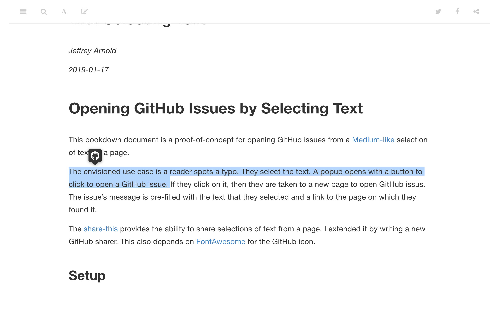

--- 
title: "A Minimal Example of Opening GitHub Issues with Selecting Text"
author: "Jeffrey Arnold"
date: "`r Sys.Date()`"
site: bookdown::bookdown_site
output: bookdown::gitbook
documentclass: book
github-repo: jrnold/bookdown-github-issues
description: "This is a minimal example of using JavaScript to open issues with selected text from a webpage."
---

# Opening GitHub Issues by Selecting Text {-}

This bookdown document is a proof-of-concept for opening GitHub issues from a  [Medium-like](https://medium.com/) selection of text on a page.
The envisioned use case for this is opening GitHub issues for typos in webpages.

To use, select some text on the page. A popover will appear with options, including opening a GitHub issue.



Click on the GitHub icon in the popover.
A new window will open with new GitHub issue for the repository.
The body of the GitHub issue will be pre-filled with the text selection and a link
to the page.


## Details {-}

The [share-this](https://github.com/MaxArt2501/share-this) provides the ability to share selections of text from a page.
I extended it by writing a new GitHub sharer.

## Setup {-}

Right now this is a proof of concept, so the only method is manually copying what is done in this repository.
Copy these files into your bookdown repository:

-   `assets/share-this/*`: distribution files copied from the share-this JavaScript package.
-   `assets/share-this-github/*`: JavaScript and CSS assets for the GitHub sharer
-   `includes/share-this.html`: A snippet of HTML included in each HTML page by bookdown. Some lines could be uncommented to load other sharers.

Configuration and initialization is handled by the `share-this-config.js` file.
It needs to be configured with the GitHub repository associated with the site.

```javascript
// settings for ShareThis
const shareThis = window.ShareThis;
// uncomment to load a twitter sharer
// const twitterSharer = window.ShareThisViaTwitter;

// set this to your
const githubRepo = "jrnold/bookdown-github-issues";
// optionally add a github label to use
const githubIssueLabel = null;
const githubSharer = new GitHubIssueSharer(githubRepo, label = githubIssueLabel);

const selectionShare = shareThis({
    // sharers: [ githubSharer, twitterSharer ]
    sharers: [ githubSharer ]
});
selectionShare.init();
```

Add this line to `_output.yml`:
```yaml
bookdown::gitbook:
  # ...
  includes:
    in_header:
    - "includes/share-this.html"
```

<!--
## Notes

-  https://medium.com/@FezVrasta/popper-js-v1-5e8b3acd888c
-  https://github.com/xdamman/selection-sharer
-  https://github.com/mvanlonden/react-selection-popover
-  https://www.bennadel.com/blog/3439-creating-a-medium-inspired-text-selection-directive-in-angular-5-2-10.htm
- https://medium.com/@mayneweb/a-medium-like-popover-without-jquery-3975c2beb422

-->
